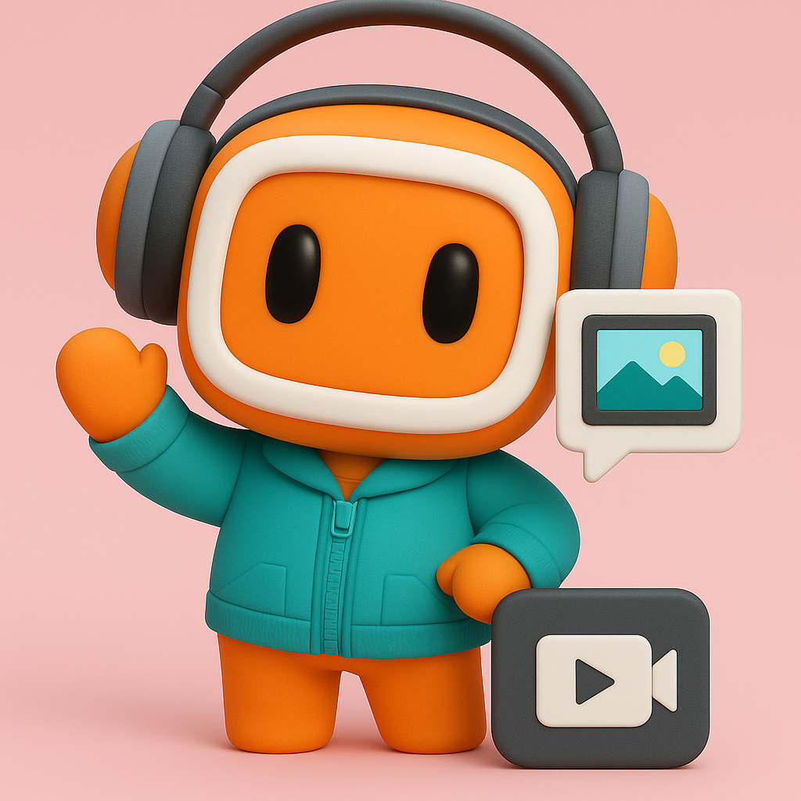

# KwaiMM-Dialogue: A Collection of Datasets for Evaluating and Generating Multimodal Interactions

    

 [[🍎 Project Page](https://stan-lei.github.io/KwaiMM-Dialogue/)] [[📖 KwaiChat](https://arxiv.org/abs/2503.06899)] [[📖 Seriesbench](https://arxiv.org/abs/2504.21435)] [[📖 GODBench](https://arxiv.org/abs/2505.11436)] 

## Introduction of the Project

Multimodal Large Language Models (MLLMs) have achieved notable advancements in tasks such as image captioning, video understanding, and vision-language dialogue, benefiting from unified semantic representations across modalities. Despite this progress, short video platforms present distinct challenges—frequent user interaction, code-switching, rapid scene transitions, and blended reposting patterns—that are insufficiently addressed by current benchmarks.

To better support modeling in these dynamic scenarios, we introduce a systematic framework for evaluating and improving MLLM capabilities in short video contexts, centered around three key benchmarks:

- **KwaiChat**: A multilingual, multi-topic dialogue dataset grounded in real short videos, enabling video-driven question answering, mixed-modal dialogue, and emotionally rich interactions.
- **SeriesBench**: A benchmark tailored for short video series, aimed at character consistency tracking, narrative reconstruction, and logical reasoning across clips.
- **GODBench**: A generation-oriented suite for multimodal “golden comment” creation, with evaluation dimensions including cultural relevance, creativity, humor, and contextual sensitivity.

The broader goal is to advance multimodal interaction from perception-level understanding to fully contextual, dialogue-centric, and creatively expressive use cases.  
Additional details, including dataset construction, evaluation protocols, and experimental results, are available on the respective pages.

## Acknowledgments
Parts of this project page were adopted from the [Academic Project Page Template](https://eliahuhorwitz.github.io/Academic-project-page-template/) and [Video-MME](https://video-mme.github.io/), thanks to the excellent work by their creators.

## Website License
 This work is licensed under a <a rel="license" href="http://creativecommons.org/licenses/by-sa/4.0/">Creative Commons Attribution-ShareAlike 4.0 International License</a>.
